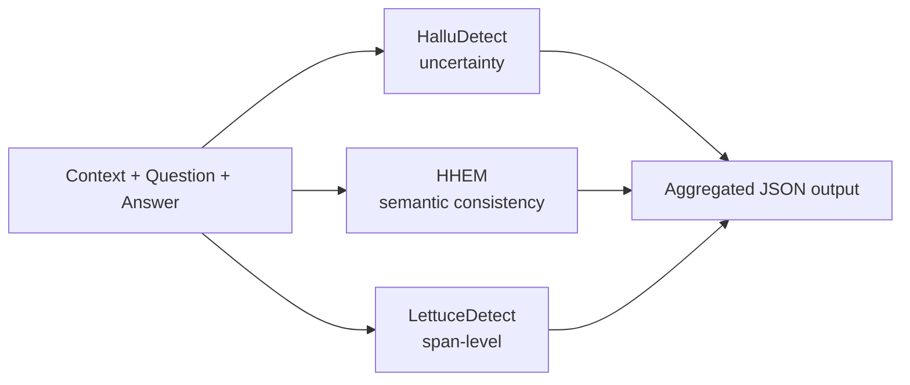

# Aluora


**Aluora** is a Python library for hallucination detection in text generated by Large Language Models. It integrates multiple complementary detection methods to assess the risk that a given LLM response is unsupported or fabricated relative to its context and question.

Designed for use in **RAG systems operating in critical environments**, where silently fabricated answers can cause real harm.

---

## Why Aluora

LLM hallucinations are not detected reliably by any single method. Each existing approach has different blind spots: uncertainty-based methods miss confidently wrong answers; consistency-based methods miss semantically plausible fabrications; lexical methods miss high-level reasoning errors.

Aluora combines three orthogonal approaches into a single API, returning a structured assessment that can be plugged into RAG pipelines, evaluation suites, or human-in-the-loop workflows.

---

## Detection methods

| Method | Approach | What it catches |
| :--- | :--- | :--- |
| **HalluDetect** | Dropout-based DenseNet with MC Dropout + mutual information for uncertainty estimation | Confidently-wrong answers; quantifies model uncertainty |
| **HHEM** | Semantic consistency scoring using a pretrained transformer classifier | Semantic mismatch between answer and grounding context |
| **LettuceDetect** | Span-level hallucination detection using contextual lexical evaluation | Pinpoints which specific spans of the answer are unsupported |

---

## Architecture



---

## Installation

From PyPI:

```bash
pip install aluora
```

From source:

```bash
git clone https://github.com/Pedro-Sarmiento/aluora.git
cd aluora
pip install -e .
```

---

## Quick start

```python
from Aluora.core.extractor import hallucination_metrics

hallucination_metrics(
    context="The robot was built in 2023.",
    question="When was the robot built?",
    answer="The robot was built in 2023.",
    output_json_path="results.json"
)
```

---

## Output structure

```json
{
  "halludetect": {
    "predicted_class": 0,
    "label": "Hallucination",
    "probability_class_1": 0.15,
    "mutual_information": 0.08
  },
  "hhem": {
    "prob_no_hallucination": 0.02,
    "risk_level": "HIGH"
  },
  "lettuce": {
    "detected_spans": [],
    "estimated_risk": "MEDIUM"
  }
}
```

### Interpreting the output

| Field | Meaning |
| :--- | :--- |
| `halludetect.predicted_class` | Binary class predicted by HalluDetect (`0` = hallucination, `1` = grounded) |
| `halludetect.probability_class_1` | Confidence the answer is grounded (closer to 1 is better) |
| `halludetect.mutual_information` | Epistemic uncertainty estimate — high values indicate the model is unsure |
| `hhem.prob_no_hallucination` | Probability that the answer is consistent with the context |
| `hhem.risk_level` | Categorical risk label derived from HHEM probability (`LOW` / `MEDIUM` / `HIGH`) |
| `lettuce.detected_spans` | List of answer spans flagged as unsupported by the context |
| `lettuce.estimated_risk` | Aggregated risk label from span-level analysis |

---

## Background

Aluora originated from a Bachelor's Thesis at the **Universidad de Las Palmas de Gran Canaria** (BSc in Data Science and Engineering), focused on the detection, mitigation, and evaluation of hallucinations in Retrieval-Augmented Generation systems for critical environments. The library packages the practical detection components of that work into a reusable tool.

---

## Roadmap

- [ ] Batch evaluation interface for full RAG test sets
- [ ] CLI for quick command-line evaluation
- [ ] Configurable thresholds for risk-level mapping
- [ ] Additional detection methods (LLM-as-a-judge, citation verification)
- [ ] Documentation site with method-by-method tutorials

Contributions and method suggestions welcome — open an issue.

---

## Citation

If you use Aluora in academic work, please cite it as:

```bibtex
@software{sarmiento_aluora,
  author = {Sarmiento Yánez, Pedro},
  title  = {Aluora: A multi-method hallucination detection library for LLMs},
  year   = {2025},
  url    = {https://github.com/Pedro-Sarmiento/aluora}
}
```

---

## License

MIT — see `LICENSE` for details.

---

## Author

**Pedro Sarmiento Yánez** — AI Engineer working on LLMs in production.

[GitHub](https://github.com/Pedro-Sarmiento) · [LinkedIn](https://www.linkedin.com/in/pedro-sarmiento-yanez)
